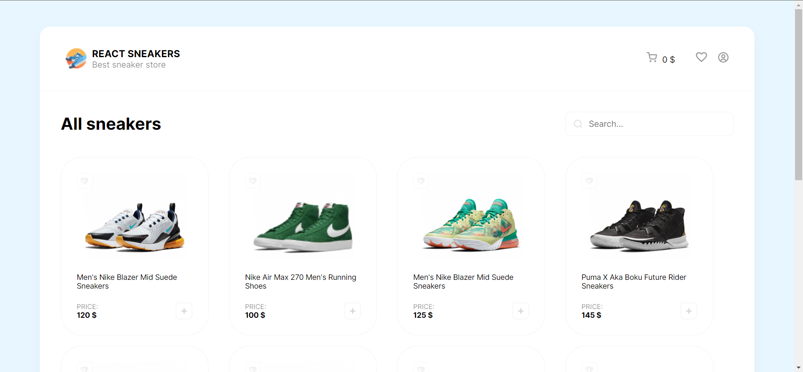

<div id="top"></div>

<!-- PROJECT LOGO -->
<br />
<div align="center">

<h3 align="center">React sneakers shop</h3>

  <p align="center">
    <a href="https://github.com/Freekson/React-Sneakers/issues">Report Bug</a>
  </p>
</div>

<!-- TABLE OF CONTENTS -->
<details>
  <summary>Table of Contents</summary>
  <ol>
    <li>
      <a href="#about-the-project">About The Project</a>
    </li>  
    <li><a href="#preview">Preview</a></li> 
    <li><a href="#instalation">Installation</a></li>
    <li><a href="#contact">Contact</a></li>
  </ol>
</details>

<!-- ABOUT THE PROJECT -->

# About The Project

### Welcome to React Sneakers!

React Sneakers is a small website built with React, showcasing a wide range of trendy sneakers for sneaker enthusiasts. The website utilizes various React hooks to deliver a seamless and interactive user experience.

#### Main features include:

**Favorites:** Users can easily add their favorite sneakers to their personal favorites list. This allows them to quickly access and browse through their preferred sneakers without any hassle.

**Shopping Cart:** React Sneakers offers a convenient shopping cart functionality. Users can add sneakers to their cart, view the contents, and manage quantities. This ensures a smooth purchasing process and enables users to keep track of their selected items.

**Order Creation:** Once users are satisfied with their selection, they can proceed to create an order. React Sneakers provides a straightforward order creation process

**Order History:** Users have access to a dedicated section where they can view their order history. This feature allows them to keep track of their past purchases and reference details such as items ordered

# Preview

_Some gifs may take a long time to load, if you want to see them wait a bit._

**Main page**



**Site preview**


**Site functional preview**


<div id="instalation"></div>

<!-- GETTING STARTED -->

# Installation

1. Clone the repo
   ```sh
   git clone https://github.com/Freekson/React-Sneakers.git
   ```
2. Go to React-Sneakers folder
   ```
   cd React-Sneakers
   ```
3. Install NPM packages
   ```sh
   npm install
   ```
4. Run server command
   ```sh
   npm run dev
   ```

See the [open issues](https://github.com/Freekson/React-Sneakers/issues) for a full list of proposed features (and known issues).
Check the [releases](https://github.com/Freekson/React-Sneakers/releases) to see completed items

<!-- CONTACT -->

# Contact

Yehor Dreval

- [LinkediIn](https://www.linkedin.com/in/yehor-dreval-1634b4207/)
- [Telegram](https://t.me/freekson)
- [Instagram](https://www.instagram.com/freeksons)

Project Link: [React Sneakers](https://github.com/Freekson/React-Sneakers)

<p align="right">(<a href="#top">Back to top</a>)</p>
